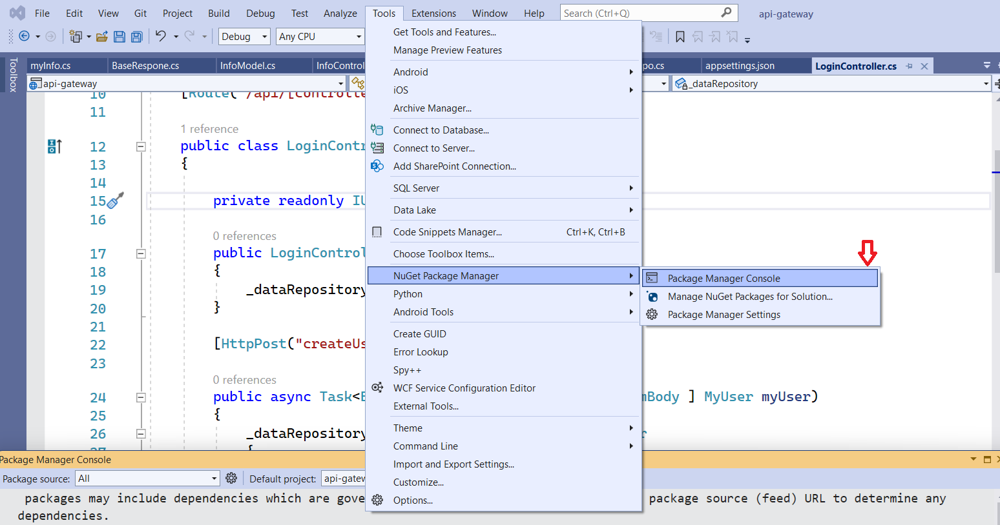

## Clone Project

```bash
  git clone https://github.com/ducviet221/ManagerSystem.git
```

## Start Front-end

Go to the project directory

```bash
  cd my-app
```

Install dependencies

```bash
  npm i
```

Start the server

```bash
  npm run dev
```

## Start Back-end

```bash
  cd api-gateway
```

1. Open api-gateway.sln with Visual Studio

2. Add Database: 

2.1 Rebuild

2.2 Click here


2.3 run this cmd:

```bash
     add-migration -context myDbContext yourname

     update-database -context myDbContext
```

